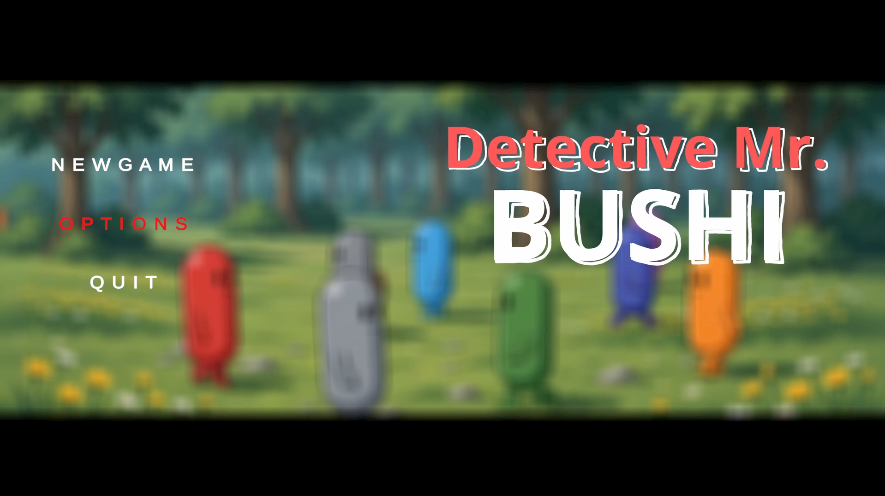
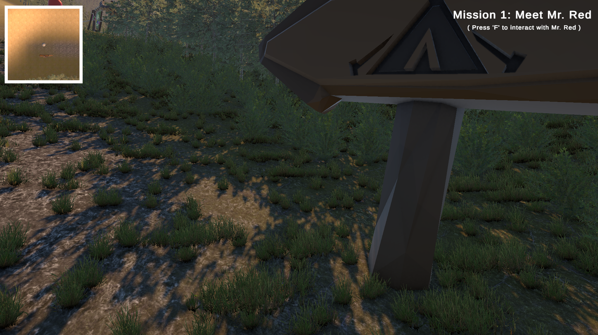
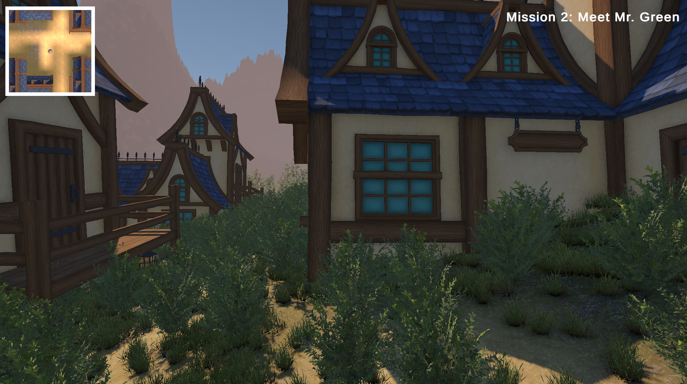

# Detective Mr. Bushi

A story-driven 3D detective adventure game developed in Unity where players investigate mysteries, interact with unique characters, gather clues, and uncover hidden truths through exploration and deduction.

---

## Game Overview

In **Detective Mr. Bushi**, players step into the shoes of a skilled detective tasked with solving a series of interconnected mysteries. Through careful observation, conversations with NPCs, and exploration of different locations, players must piece together evidence and progress through the story.

The game focuses on:

* Investigation
* Exploration
* NPC Interaction
* Mystery Solving
* Story-Driven Gameplay
* Clue Collection
* Environmental Storytelling

---

## Controls

### Movement

* W → Move Forward
* S → Move Backward
* A → Move Left
* D → Move Right

### Camera

* Mouse Left Click → Rotate Camera

### Actions

* Shift + W → Run
* Space → Jump

### Interaction

* F → Talk to NPC
* K → Close Dialogue
* G → Enter / Exit Mission Area

---

## Features

* Interactive Dialogue System
* Multiple Investigation Areas
* Mission-Based Progression
* Story-Driven Narrative
* Character Interactions
* Immersive Sound Design
* Custom UI System

---

## Game Images

  
  
  

---

## Built With

* Unity 6
* C#
* Universal Render Pipeline (URP)
* Unity Input System

---

## Developer

### Creator

BUSHI KUN

### Developer

BUSHI KUN

### Script Writer

BUSHI KUN

### Editor

BUSHI KUN

---

## Copyright Notice

All music, sound effects, trademarks, logos, and other copyrighted materials used in this project belong to their respective owners.

No copyright infringement is intended.

---
